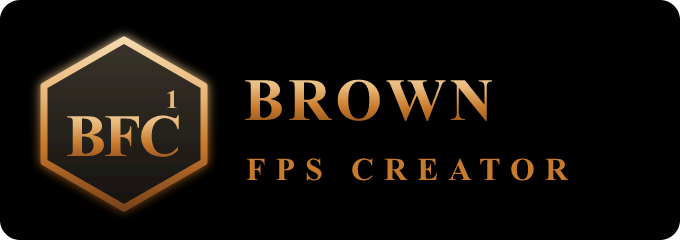

<div align="center">



# Brown FPS Creator

### Make your own first-person shooter. No coding. No engine wrangling. Just build.


-8b4513)


</div>

> This is the **public showcase** for Brown FPS Creator — a portfolio and downloads
> page. The full source is proprietary and kept in a private repository; this repo
> contains no engine or project source.

---

## What is Brown FPS Creator?

**Brown FPS Creator** is a beginner-friendly, **no-code FPS game maker** — a complete
toolkit for building your own first-person shooter without writing a single line of
code. Design levels, import sprites, give enemies behavior, and make characters that
*talk* (not just get shot), all through visual editors. Then package and publish a
real, standalone game for **Windows, Linux, and Steam Deck**.

If you loved tinkering in classic FPS makers but bounced off the moment they asked you
to script, this is for you. Point, click, build, ship.

## Why you'll like it

- **Zero scripting, ever.** Every behavior is configured with visual editors. The
  author never touches a programming language.
- **Characters that talk.** First-class branching dialogue trees — build NPCs and
  conversations, not just monsters to shoot.
- **Own engine, owned performance.** A lean, in-house engine (codename **BFC1**) with
  OpenGL + Vulkan rendering — fast, modern, and entirely custom.
- **Steam Deck is a first-class target.** Native/Proton, controller mapping, 1280x800,
  and a real performance budget — tested, not assumed.
- **One-click test and build.** Go from editing to a running game and back without
  leaving the tool.

## How it works

You build a game in five stages — each one a visual editor, never a script:

```
story  ->  level design  ->  import sprites  ->  set behavior (enemies + talkers)
       ->  package  ->  publish (Windows + Linux + Steam Deck)
```

Under the hood, every click compiles to **declarative game data** — clean, structured
content the engine reads directly. You get the power of a full FPS engine with the ease
of a visual builder.

### Content model

- **Enemies and anything that moves** -> crisp **2D sprites**.
- **Static props and objects** -> lightweight **3D meshes (OBJ)**.
- **Walkable buildings and arenas** -> real **level geometry with collision**.
- **Your whole game** -> packaged into a single protected container that ships as a
  standalone executable.

## Screenshots

> _Coming soon._ Screenshots and a trailer of the engine and Creator GUI will be added
> here as the first game takes shape.

<!-- Placeholder slots — drop images into docs/screenshots/ and reference them here:


-->

## Download

> _Coming soon._ Playable builds for **Windows**, **Linux**, and **Steam Deck** will be
> posted to the [Releases](../../releases) page. Watch this repo to be notified.

## Built for players and makers

| Target | Support |
|---|---|
| Windows | First-class |
| Linux | First-class |
| Steam Deck | First-class (native/Proton, controller, 1280x800) |

## About

Brown FPS Creator is an independent project by **Felipe Carvajal Brown** — a no-code
game maker built on a custom, in-house engine. Follow along here for updates, builds,
and media.

- **Author:** Felipe Carvajal Brown
- **Contact:** fcarvajalbrown@gmail.com
- **ORCID:** [0000-0002-8300-7587](https://orcid.org/0000-0002-8300-7587)

## License

**Proprietary. All rights reserved.** Copyright 2026 Felipe Carvajal Brown.

This repository is a public showcase only. It contains no source code. The Brown FPS
Creator engine, tools, and project files are proprietary and are not licensed for
redistribution, modification, or reuse.

---

<div align="center">

**Tags:** `fps-game-maker` · `no-code` · `game-engine` · `first-person-shooter` ·
`game-development` · `level-editor` · `steam-deck` · `indie-games` · `game-creator` ·
`visual-scripting` · `retro-fps` · `boomer-shooter` · `opengl` · `vulkan` · `cpp`

</div>
